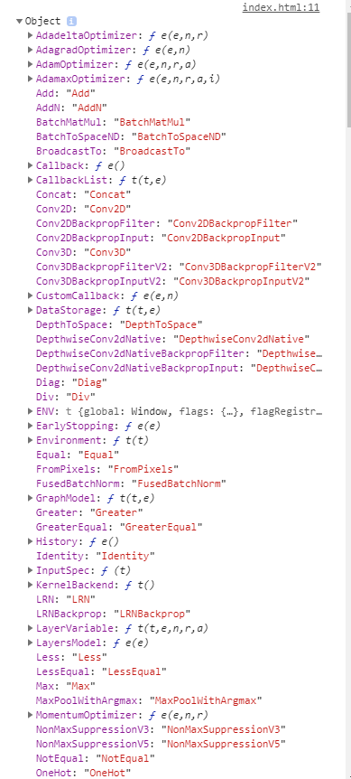
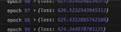
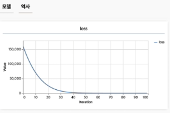

해당 프로젝트는 <a href="https://www.youtube.com/user/egoing2">생활코딩</a> 님의 프로젝트를 간단히 요약한 것 임을 밝힙니다.


## Tensorflow JS

TensorFlow 는 Python 의 기존 라이브러리 였으나 , 사용방법이 거의 같게 JavaScript 버전으로 나온 것 이 TensorflowJS 이다.

머신러닝을 통하여 우리는 기계에게 많은량의 데이터를 주고 문제에 직면하였을 때 기계는 우리가 지도한 정보를 바탕으로 어떠한 결과를
도출시킬 수 있나를 테스트 해보는 것이 이번 Repository 의 목표이다.

## 학습 경로


위 사진을 보고 우리가 학습해야할 경로를 알 수 있다.

## 모델 생성 방법


앞서 말했듯이 우리는 기계에게 정보를 제공해주기 위하여 모델을 만들어야 하는데 이 방법에는 세 가지 방법이 있다.

1. 기존 모델을 가져다 사용하는 것
2. 기존 모델을 수정하여 사용하는 것
3. 직접 제작하는 것

위 사진은 해당 내용을 담아낸 사진이다.

## 기존 모델 사용하기

<a href="https://www.tensorflow.org/js">공식 홈페이지</a> 에 들어가서 기존 모델 코드를 받아올 수 있는데,
해당 프로젝트에서는 이미지 모델을 사용해 볼 것이다.


```html
<!-- TensorFlow JS 를 불러온다. -->
<script src="https://cdn.jsdelivr.net/npm/@tensorflow/tfjs@1.0.1"> </script>
<script src="https://cdn.jsdelivr.net/npm/@tensorflow-models/mobilenet@1.0.0"> </script>
<!-- img 태그를 만든다 해당 사진은 CORS 정책에 막히지 않게 해주어야 함 -->
</img>
<script>
  const img = document.getElementById('img');
  // 모델을 불러온다.
  mobilenet.load().then(model => {
    // 불러온 모델에서 img 태그 사진을 검사한다
    model.classify(img).then(predictions => {
      console.log('Predictions: ');
      console.log(predictions);
    });
  });
</script>
```

실행 결과는


위와 같이 결과에 대해 몇% 정도 닮아있는지 또한 출력된다.

## TensorflowJS 설치

cdn

```html
<script src="https://cdn.jsdelivr.net/npm/@tensorflow/tfjs@2.0.0/dist/tf.min.js"></script>
```

yarn

```javascript
yarn add @tensorflow/tfjs

 /test.js

const tf = require('@tensorflow/tfjs');
```

```javascript
console.log(tf)
```

시 아래와 같은 화면이 출력되면 된다.



## tf.tensor

Tensorflow 의 기계학습을 위해서는 데이터를 tensor 형태로 바꾸어주어야 하는데 ,

```javascript
const 온도 = [20,21,22,23];
// tensor 의 형태로 변환된 온도 배열을 원인 변수에 삽입
const 원인 = tf.tensor(온도);
```

위와 같이 변환하여주지 않으면 일반배열은 학습할 수 없다.

## 모델 만들기

```javascript
const X = tf.input({ shape: [1] });
// 1 개의 X축을 만듦 shape:[N]
const Y = tf.layers.dense({ units: 1 }).apply(X);
// 1 개의 Y 축을 만들며 이는 X 축 데이터에 적용시키는 값임 units: N
const model = tf.model({ inputs: X , outputs: Y });
// X 의 원인으로 Y 의 결과를 도출하는 모델을 만듦
const compileParam = { optimizer: tf.train.adam() , loss: tf.losses.meanSquaredError }
// 모델의 초기설정을 해줌
model.compile(compileParam);
// 초기 설정을 바탕으로 우리가 만들었던 모델에 적용함
```

## 모델 입히기

```javascript
// 파라미터로 epochs 만큼 반복을하여 학습시킬 것을 정의함
var fitParam = { epochs: 100} 
// 학습을 시작하며 끝난 경우에는 epochs 만큼의 학습 끝에 내놓은 결론을 print 함
model.fit(원인, 결과, fitParam).then(function (result) {
    var 예측한결과 = model.predict(원인);
    예측한결과.print();
});  
```

## 모델 사용하여 미래 예측하기

```javascript
// 다음 주 온도를 삽입
var 다음주온도 = [15,16,17, 18, 19]
// 기계학습이 가능하도록 tf.tensor() 변환을 해줌
var 다음주원인 = tf.tensor(다음주온도);
// 만들어진 model 로 결과를 변수에 대입함
var 다음주결과 = model.predict(다음주원인);
// 결과 화면에 출력
다음주결과.print();
```

model.fit() 에 들어갈 3개의 인자에서 마지막 세 번째 인자는 단순히 { epochs: number } 보다 다양한 옵션을 줄 수 있는데,

```javascript
var fitParam = { 
  // 반복 횟수
  epochs: 100,
  // 부가 옵션
  callbacks:{
    // 학습이 끝났을 때
    onEpochEnd:function(epoch, logs){
      // epoch 는 몇 번째 시도인지 에 대한 정보 , logs 는 실패도 를 갖고있다.
      console.log('epoch', epoch, logs)
    }
  }
}
```



이 값이 높다면 더 많은 학습을 해야한다는 의미이며 , 이 값이 0.1 정도의 수치로 낮아졌다면,
더 반복한다고 하더라도 학습의 결과는 같아지므로 학습의 끝을 의미한다.

## 저장 및 불러오기

```javascript
// 나의 모델을 localStorage 상으로 저장하며 이름은 my-model-1 이다.
// 즉 다른 사이트 및 브라우저를 종료했다 키더라도 정보는 남아있음.
const saveResult = await model.save('localstorage://my-model-1');

// localStorage 에서 이름이 my-model-1 인 파일을 읽어온다
const model = await tf.loadLayersModel('localstorage://my-model-1');
// 즉 바로 사용이 가능함
model.predict(tf.tensor([20])).print()
```

### VIS

TensorflowJS 에는 화면으로 model 의 loss 값을 실시간으로 확인할 수 있게 vis 라는 시각화 도구를 제공하는데

```html
<script src="https://cdn.jsdelivr.net/npm/@tensorflow/tfjs-vis"></script>
```

```javascript
tfvis.show.history({name:'시각화 도구의 타이틀' , tab:'탭 도구 이름'} , 데이터 흐름을 가진 배열 객체  , ['변화를 볼 데이터 이름']);

// 예전 예제에서 
// 빈 배열 하나를 추가함
const _history = []
var fitParam = { 
  // 반복 횟수
  epochs: 100,
  // 부가 옵션
  callbacks:{
    // 학습이 끝났을 때
    onEpochEnd:function(epoch, logs){
      // 배열에 logs 객체를 삽입함 이 때 tfvis.show.history 의 세 번째 인자의 값 은 logs.loss 값으로 동일한 이름을 사용해야함
      _history.push(logs)
      // epoch 는 몇 번째 시도인지 에 대한 정보 , logs 는 실패도 를 갖고있다.
      tfvis.show.history({name:'loss' , tab:'역사'} , _history , ['loss'])
    }
  }
}
```

결과 화면은 아래와 같다


