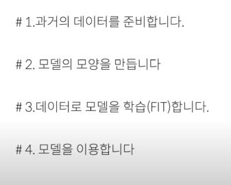
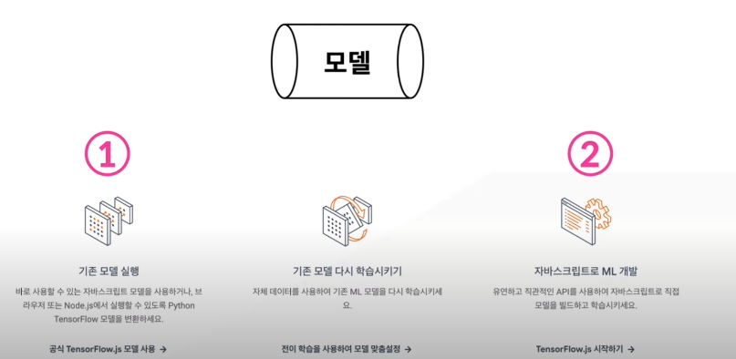
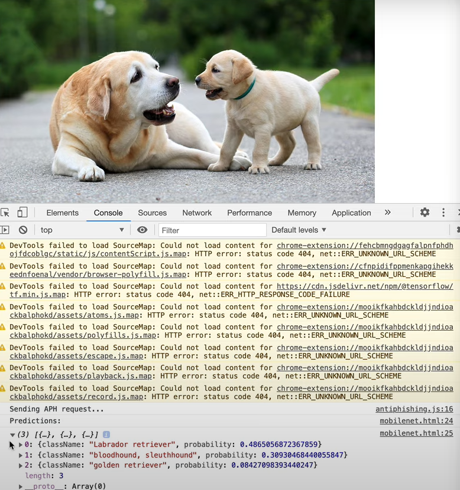

해당 프로젝트는 <a href="https://www.youtube.com/user/egoing2">생활코딩</a> 님의 프로젝트를 간단히 요약한 것 임을 밝힙니다.


## Tensorflow JS

TensorFlow 는 Python 의 기존 라이브러리 였으나 , 사용방법이 거의 같게 JavaScript 버전으로 나온 것 이 TensorflowJS 이다.

머신러닝을 통하여 우리는 기계에게 많은량의 데이터를 주고 문제에 직면하였을 때 기계는 우리가 지도한 정보를 바탕으로 어떠한 결과를
도출시킬 수 있나를 테스트 해보는 것이 이번 Repository 의 목표이다.

## 학습 경로



위 사진을 보고 우리가 학습해야할 경로를 알 수 있다.

## 모델 생성 방법



앞서 말했듯이 우리는 기계에게 정보를 제공해주기 위하여 모델을 만들어야 하는데 이 방법에는 세 가지 방법이 있다.

1. 기존 모델을 가져다 사용하는 것
2. 기존 모델을 수정하여 사용하는 것
3. 직접 제작하는 것

위 사진은 해당 내용을 담아낸 사진이다.

## 기존 모델 사용하기

<a href="https://www.tensorflow.org/js">공식 홈페이지</a> 에 들어가서 기존 모델 코드를 받아올 수 있는데,
해당 프로젝트에서는 이미지 모델을 사용해 볼 것이다.


```html
<!-- TensorFlow JS 를 불러온다. -->
<script src="https://cdn.jsdelivr.net/npm/@tensorflow/tfjs@1.0.1"> </script>
<script src="https://cdn.jsdelivr.net/npm/@tensorflow-models/mobilenet@1.0.0"> </script>
<!-- img 태그를 만든다 해당 사진은 CORS 정책에 막히지 않게 해주어야 함 -->
</img>
<script>
  const img = document.getElementById('img');
  // 모델을 불러온다.
  mobilenet.load().then(model => {
    // 불러온 모델에서 img 태그 사진을 검사한다
    model.classify(img).then(predictions => {
      console.log('Predictions: ');
      console.log(predictions);
    });
  });
</script>
```

실행 결과는



위와 같이 결과에 대해 몇% 정도 닮아있는지 또한 출력된다.

## TensorflowJS 설치

cdn

```html
<script src="https://cdn.jsdelivr.net/npm/@tensorflow/tfjs@2.0.0/dist/tf.min.js"></script>
```

yarn

```javascript
yarn add @tensorflow/tfjs
```
